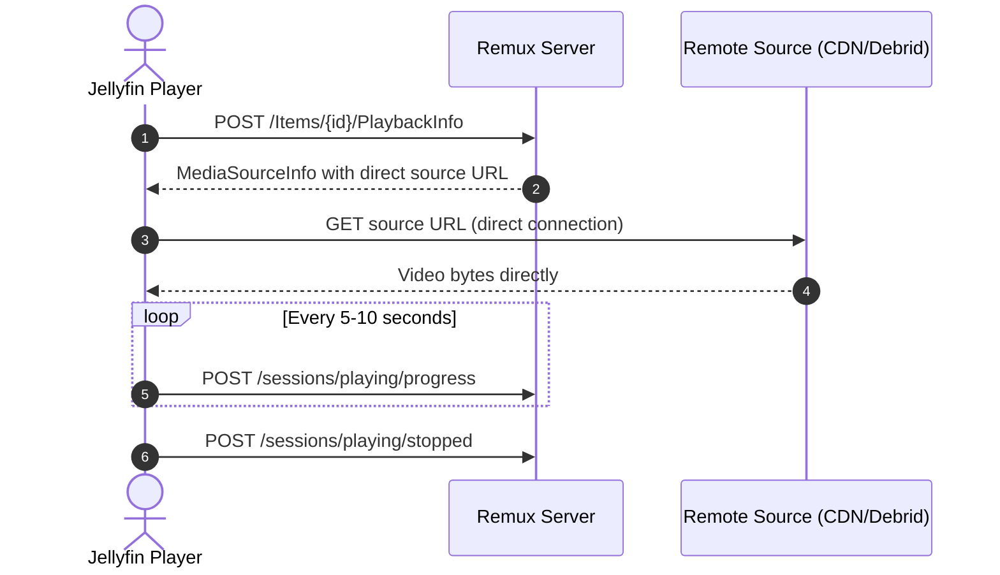

<div align="center">
   
</div>

<div align="center">
  <h1><b>Remux (remuxHTTP)</b></h1>
  <p><i>Self-hosted media server with a Jellyfin-compatible API, direct HTTP streaming, and Simkl integration</i></p>
  <a href="https://discord.gg/rEbhk4RBhs">
    
  </a>
</div>

---

## About this project

This project is an enhanced fork of [Remux](https://github.com/lostb1t/remux), a Rust media server that combines Stremio add-ons, local files, WebDAV sources, torrents, and music providers behind a Jellyfin-compatible API.

This fork preserves Remux's core goal of working seamlessly with existing Jellyfin clients while introducing major streaming, networking, and tracking enhancements:
1. **Direct HTTP Playback**: Reachable HTTP streams are passed straight to players as remote HTTP sources, and `/videos/{id}/stream` issues direct HTTP 302 redirects instead of relaying video bytes through the server.
2. **Multi-User Simkl Scrobbling**: Native watch history tracking with a 1-click **RFC 8628 Device / PIN flow** (`simkl.com/pin`) right from the web dashboard.
3. **Client IP Forwarding & LAN Protection**: Propagates each user's real public IP to Stremio add-ons (preventing shared-IP rate limits and debrid geo-blocks) while strictly filtering out private LAN subnets.
4. **Dynamic Regex Stream Routing**: Syncs and evaluates dynamic regex rules from remote endpoints or local cache to match, filter, and prioritize streams.
5. **Multi-Provider Metadata Fallbacks**: Intelligent fallback across IMDB, TMDB, TVDB, and Kitsu IDs with manifest prefix filtering.
6. **Full Upstream Sync (v0.33+)**: Integrates device profile stream sorting, local IPTV/EPG search, and OpenTelemetry tracing.

---

## Features

- **Jellyfin-compatible clients**: Use Infuse, Swiftfin, Jellyfin for Android/Fire TV, Jellyfin Web, Streamyfin, Findroid, and more without client modifications.
- **Direct remote playback**: Reachable HTTP streams are returned to players as HTTP media sources, letting clients stream straight from CDNs, debrid providers, or remote hosts.
- **Multi-user Simkl scrobbling**: Automatically scrobbles watched movies and episodes to Simkl upon reaching the configured threshold, with 1-click PIN authorization.
- **Multiple content sources**: Combine Stremio add-ons, local files, WebDAV servers, torrents, and remote music sources in one library.
- **Safe fallback streaming**: Local files, torrents, and internal hosts continue through Remux's proxy streaming path when a direct URL cannot be safely exposed.
- **Built-in torrent streaming**: Stream torrents without running a separate torrent client or downloading the entire file first.
- **Probe data & RemuxDB**: Audio, codec, and subtitle track metadata is cached and resolved through [RemuxDB](https://remuxdb.1632022.xyz).
- **Stream sorting & device capability profiles**: Automatically sorts stream versions by direct-play capability, resolution, and release source.
- **Client IP forwarding & LAN IP protection**: Forwards individual public client IPs (`X-Forwarded-For`, `X-Real-IP`) to upstream add-ons, while stripping internal LAN IPs and proxy headers to avoid 429 rate limits and debrid account flags.
- **Dynamic regex stream routing**: Dynamically updates and syncs stream categorization and filtering rules from remote URLs.
- **IPTV & EPG search**: Full offline, local search across IPTV channels and electronic program guides.
- **Playback tracking**: Continue watching, resume points, watched state, and play counts remain synchronized across clients.
- **Custom admin dashboard**: Intuitive Dioxus-based web management UI served at `/admin`.
- **Desktop tray app**: Optional system tray app for macOS, Linux, and Windows.

---

## Direct Streaming Architecture

### Why the fork changes playback

The standard proxy flow requires the Remux server to download every video chunk from the remote source and re-upload it to the client. This introduces unnecessary bandwidth, CPU overhead, latency, and buffering on the server, and prevents modern players (Infuse, Swiftfin, Streamyfin) from utilizing their native connection engines.

For an externally reachable HTTP stream:



When a player requests `/videos/{id}/stream` directly, Remux issues a temporary **HTTP 302 redirect** directly to the target URL, ensuring complete backwards compatibility without data relaying.

### URL Safety & Fallback

Remux only forwards URLs that players can reach externally. Internal addresses—including loopback (`127.0.0.1`), LAN subnets (`192.168.x.x`, `10.x.x.x`, `172.16.x.x`), link-local, CGNAT, Docker internal network aliases, `.local`, and `.internal` hosts—are kept on the internal fallback streaming path.

---

## Simkl Integration & Scrobbling

Remux includes native, multi-user [Simkl](https://simkl.com) scrobbling using Simkl's official **AUTH V2 Device / PIN flow (RFC 8628)**.

### Setting up Simkl:

1. **Global Client ID**:
   - Go to the Remux Dashboard: **Settings > Simkl**.
   - Enter your Simkl API **Client ID** (create an app at [simkl.com/settings/developer](https://simkl.com/settings/developer/new/)).
   - Set the desired completion threshold (default: `80%`).
2. **User Connection (1-Click PIN Flow)**:
   - Navigate to **Access > Users** and click **Edit** on any user.
   - In the **Simkl Scrobbling** section, click **"Connect with Simkl"**.
   - Click **"Open Simkl Approval ↗"** (or browse to [simkl.com/pin](https://simkl.com/pin) and enter the displayed 8-character code).
   - Click **Allow** on Simkl.
   - The dashboard automatically detects the authorization, stores the user token securely, and enables live scrobbling!

---

## Client IP Forwarding & Rate-Limit Protection

In multi-user setups running on a shared server, NAS, or Docker host, all outbound requests to Stremio add-ons and debrid providers would normally share the server's single IP address. This causes:
1. `HTTP 429 Too Many Requests` rate limits from scrapers and metadata add-ons.
2. Account suspensions or locks from debrid providers enforcing single-IP policies.

### How Remux protects you:
- **Transparent IP Forwarding**: Remux extracts each client's remote IP address (`X-Forwarded-For`, `X-Real-IP`, or connection socket) and forwards it to Stremio SDK calls.
- **LAN & Private IP Filtering**: Private LAN IPs (such as `192.168.1.50` or loopback) are never forwarded to public providers.
- **Proxy Header Sanitization**: Untrusted or internal headers like `CF-Connecting-IP` are dropped.
- **Manifest & Catalog Caching**: Catalogs are cached for 15 minutes and stream candidate lookups are cached for 5 minutes with per-media concurrency locks.

---

## Dynamic Regex Stream Routing

Configure custom regex patterns to categorize and route streams dynamically. Patterns can be defined in your config or pulled automatically from remote endpoints:

```toml
[dynamic_regex]
urls = ["https://example.com/stream-rules.json"]
sync_interval_secs = 3600
fallback_cache_path = "/data/regex_cache.json"
```

---

## Jellyfin 12 Compatibility

Remux supports the **Jellyfin 12** specification while maintaining backwards compatibility with Jellyfin 10.x:

- **Server Versioning**: Reports version `12.1.0` by default (configurable via `jellyfin_version` in `config.toml` or `REMUX_JELLYFIN_VERSION`).
- **Modern Authentication**: Supports modern Jellyfin 12 authorization headers (`Jellyfin Client="..."`), standard `Bearer <token>`, and legacy `MediaBrowser`/`Emby` headers.
- **Bundled Jellyfin Web 12.1**: Serves the official Jellyfin Web client with modern controls, responsive layout, and improved subtitle formatting.
- **API Stubs**: Includes modern fallback fonts, backup endpoints, and alternate source endpoints.

---

## Building and Running

### 1. Docker (Recommended)

Run with Docker Compose using the official automated builds:

```yaml
services:
  remuxHTTP:
    image: ghcr.io/robertaidenschofield/remuxhttp:nightly
    container_name: remuxHTTP
    restart: unless-stopped
    ports:
      - '3000:3000'
    volumes:
      - ./data:/data
    environment:
      - PORT=3000
      - DATA_DIR=/data
```

```sh
docker compose up -d
```

#### Networking with AIOStreams for Direct Play
When running Remux alongside AIOStreams in Docker, configure your AIOStreams add-on URL in the Remux dashboard using your **host's LAN IP or public domain** (e.g. `http://192.168.1.100:3000/manifest.json`), **not** internal Docker network names (`http://aiostreams:3000`). This ensures external players receive links they can actually resolve and connect to.

---

### 2. Local / Native Development

#### Prerequisites
- **Rust toolchain** (1.80+): `rustup default stable`
- **Node.js** (v22+): For compiling `jellyfin-web`
- **Cargo Make**: `cargo install --force cargo-make`
- **Dioxus CLI** (0.7.9): `cargo install dioxus-cli --version 0.7.9 --locked`

#### Setup & Build
```sh
cp .env.example .env
cargo make jellyfin-web
cargo make build-desktop-dash

# Run development server with live reload
cargo make dev

# Or build release binary
cargo build --release -p remux-server
```

---

## Contributing & License

Issues, feature requests, and pull requests are welcome. Remux is licensed under the GPL-3.0 License.
