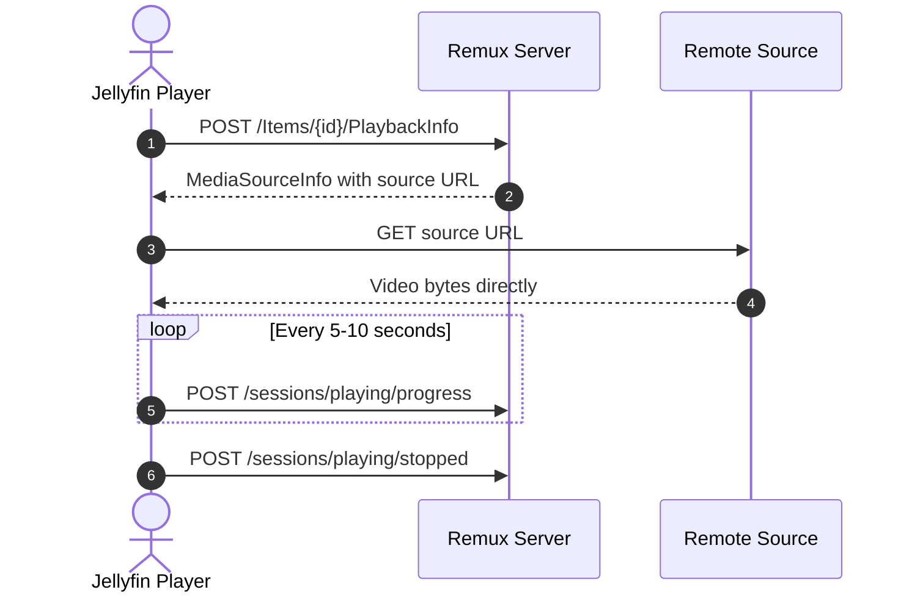

<div align="center">
   
</div>

<div align="center">
  <h1><b>Remux</b></h1>
  <p><i>Self-hosted media server with a Jellyfin-compatible API</i></p>
  <a href="https://discord.gg/rEbhk4RBhs">
    
  </a>
</div>

---

## About this project

This project is a fork of [Remux](https://github.com/lostb1t/remux), a Rust media server that combines Stremio add-ons, local files, WebDAV sources, torrents, and music providers behind a Jellyfin-compatible API.

The fork keeps Remux's goal of working with existing Jellyfin clients while changing how reachable HTTP streams are delivered: remote players receive the original stream URL and connect to the source directly. Remux remains responsible for metadata, session events, progress, resume points, and watched state, but it does not relay the video bytes when direct playback is safe.

## Features

- **Jellyfin-compatible clients**: Use Infuse, Swiftfin, Jellyfin for Android, Jellyfin Web, and other compatible clients without client changes.
- **Multiple content sources**: Combine Stremio add-ons, local files, WebDAV servers, torrents, and remote music sources in one library.
- **Direct remote playback**: Reachable HTTP streams are returned to players as HTTP media sources so the player connects directly to the CDN, add-on, or debrid provider.
- **Safe fallback streaming**: Local files, torrents, internal hosts, and other sources continue through Remux's streaming path when a direct URL cannot be safely exposed.
- **Built-in torrent streaming**: Stream torrents without running a separate torrent client or downloading the complete file first.
- **Probe data for streams**: Audio and subtitle track metadata is available for streamed content through [RemuxDB](https://remuxdb.1632022.xyz).
- **Library filtering**: Build dynamic libraries using tags, catalogs, popularity, release year, and per-user visibility rules.
- **Playback tracking**: Continue watching, resume points, watched state, and play counts remain synchronized across clients.
- **User management**: Import users and data from an existing Jellyfin server.
- **Desktop app**: Run the server from a macOS, Linux, or Windows tray application without Docker or a terminal.
- **Custom dashboard**: Configure the server through a built-in admin interface.
- **IPTV support**
- **Client IP forwarding & rate-limit protection**: Forwards individual client IPs (`X-Forwarded-For`, `X-Real-IP`, `CF-Connecting-IP`) to upstream manifests and add-ons to prevent shared IP rate-limiting (`HTTP 429`) in multi-user setups.

## Direct streaming architecture

### Why the fork changes playback

The original proxy flow made Remux download every remote video and upload it again to the player. That added bandwidth, CPU usage, latency, and buffering on the Remux host, and prevented clients such as Infuse, Fusion, and Strand from using their native remote-streaming behavior.

For an externally reachable HTTP stream, the playback flow is now:



When a client still requests `/videos/{id}/stream`, Remux returns a temporary HTTP 302 redirect for a safe external HTTP source. This preserves compatibility with clients that use the Jellyfin stream endpoint while still avoiding a data relay.

### URL safety

Remux only forwards HTTP URLs that players can reasonably reach. Internal and private addresses, including loopback, LAN, link-local, CGNAT, Docker, `.local`, `.internal`, and `.lan` hosts, remain on the fallback proxy path.

Some add-ons return container-only URLs. For AIOStreams, Remux rewrites those URLs to the public origin from the add-on's `manifest_url` before exposing them to a player.

### Progress tracking still works

Direct playback does not bypass the Jellyfin session API. Players continue to report playback independently of the video connection:

| Endpoint                          | Purpose                                        |
| --------------------------------- | ---------------------------------------------- |
| `POST /sessions/playing`          | Register playback and its play session.        |
| `POST /sessions/playing/progress` | Update `PositionTicks` and live session state. |
| `POST /sessions/playing/stopped`  | Persist the final position and watched state.  |

Because playback metadata still includes the item ID and play session ID, resume points, scrobbling, webhooks, and watched state remain available even when the video bytes come directly from the remote source.

### Client IP forwarding & manifest rate-limit protection

When Remux is hosted on a single server or NAS (such as in Docker) for multiple users, each user may configure their own AIOStreams, AIOMetadata, or Stremio add-on manifests with personal scraper and debrid accounts.

Without IP forwarding, all manifest queries, catalog lookups, and stream searches originate from the Remux host's single IP address. Upstream providers and scraping services frequently rate-limit such shared-IP traffic (`HTTP 429 Too Many Requests`).

To eliminate upstream rate-limiting:

- **Transparent IP Forwarding**: Remux extracts each client's remote IP address from incoming request headers (`X-Forwarded-For`, `X-Real-IP`) or connection socket and attaches them to all outbound Stremio SDK requests (`X-Forwarded-For`, `X-Real-IP`, and `CF-Connecting-IP`). Upstream add-on instances, scrapers, and Cloudflare see each end-user's distinct IP address.
- **Manifest & Catalog Caching**: Search catalog metadata is cached for 15 minutes (900s) and stream candidate lookups are cached for 5 minutes (300s) with per-media concurrency locking. This eliminates redundant calls to upstream manifests during catalog browsing or rapid stream switching.
- **Reverse Proxy Support**: If Remux is hosted behind a reverse proxy (e.g. Nginx, Traefik, Caddy, Cloudflare Tunnel, or Synology Reverse Proxy), ensure `X-Forwarded-For` or `X-Real-IP` is passed to Remux so individual user client IPs are preserved and forwarded.

## Jellyfin 12 Compatibility

Remux is updated to support the **Jellyfin 12** specification while preserving full backwards compatibility for Jellyfin 10.x players:

- **Server Versioning**: Reports version `12.1.0` by default (configurable via `jellyfin_version` in `config.toml` or the `REMUX_JELLYFIN_VERSION` environment variable).
- **Authentication Schemes**: Supports both modern Jellyfin 12 authorization headers (`Jellyfin Client="...", Device="...", DeviceId="...", Version="...", Token="..."` and standard `Bearer <token>`), as well as legacy `MediaBrowser` and `Emby` schemes for third-party players (Infuse, Swiftfin, Findroid).
- **Jellyfin Web 12.1**: Bundles and serves the official Jellyfin Web `v12.1` client with the Modern UI layout, improved subtitle rendering, and modern playback controls.
- **Jellyfin 12 API Stubs**: Includes fallback font (`GET /FallbackFont/Fonts`), backup management (`GET /Backup`, `GET /Backup/Manifest`), and alternate source management (`DELETE /Videos/{id}/AlternateSources`) endpoints expected by modern clients and admin dashboards.

## Building and Running

### 1. Docker (Recommended)

To build and run this modified version with Docker, use the included multi-stage build. You do **not** need Rust, Node, or Dioxus installed on your host system—Docker will compile `jellyfin-web`, the admin dashboard, and the server binary inside build containers:

```sh
# Build from source and run in the background
docker compose up -d --build
```

#### Docker Compose Configuration (`docker-compose.yml`)

```yaml
services:
  remuxHTTP:
    image: ghcr.io/robertaidenschofield/remuxhttp:nightly
    container_name: remuxHTTP
    restart: unless-stopped
    ports:
      - '3000:3000'
    volumes:
      - ./data:/data
    environment:
      - PORT=3000
      - DATA_DIR=/data
```

#### Important: Docker Networking with AIOStreams for Direct Play

When Remux and AIOStreams are both running in Docker:

- In the Remux Dashboard (`http://<server-ip>:3000/admin`), configure the AIOStreams add-on using your **host's LAN IP or public domain**:
  ```
  http://192.168.1.X:3000/manifest.json
  ```
  _(Do not use internal Docker aliases like `http://aiostreams:3000/manifest.json`)_.
- **Why**: Remux automatically rewrites internal container URLs (`aiostreams:...`) to match the manifest URL's origin. Using your LAN IP or domain ensures external players (Infuse, Swiftfin, Strand, Fusion, TV apps) on your network receive a reachable link to stream from directly.

---

### 2. Local / Native Development Build

To build and develop directly on your host:

#### Prerequisites

- **Rust toolchain** (1.80+): `rustup default stable`
- **Node.js** (v22+ / v24+): For building `jellyfin-web` (v12.1)
- **Cargo Make**: `cargo install --force cargo-make`
- **Dioxus CLI** (0.7.9): `cargo install dioxus-cli --version 0.7.9 --locked`

#### Setup & Build

1. Copy the example environment file:

   ```sh
   cp .env.example .env
   ```

2. Checkout and build `jellyfin-web`:

   ```sh
   cargo make jellyfin-web
   ```

3. Build the Dioxus dashboard:

   ```sh
   cargo make build-desktop-dash
   ```

4. Build or run the server:

   ```sh
   # Run development server with live reload
   cargo make dev

   # Or build release binary
   cargo build --release -p remux-server
   ```

5. (Optional) Bundle desktop application (macOS `.dmg`, Linux `.deb`, Windows `.exe`):
   ```sh
   cargo make bundle-desktop
   ```

## Contributing

Issues, feature requests, and pull requests are welcome. Please test changes, explain behavior in human-written issue and pull request descriptions, and disclose significant AI-assisted contributions. Contributors remain responsible for understanding, reviewing, and testing everything they submit.

