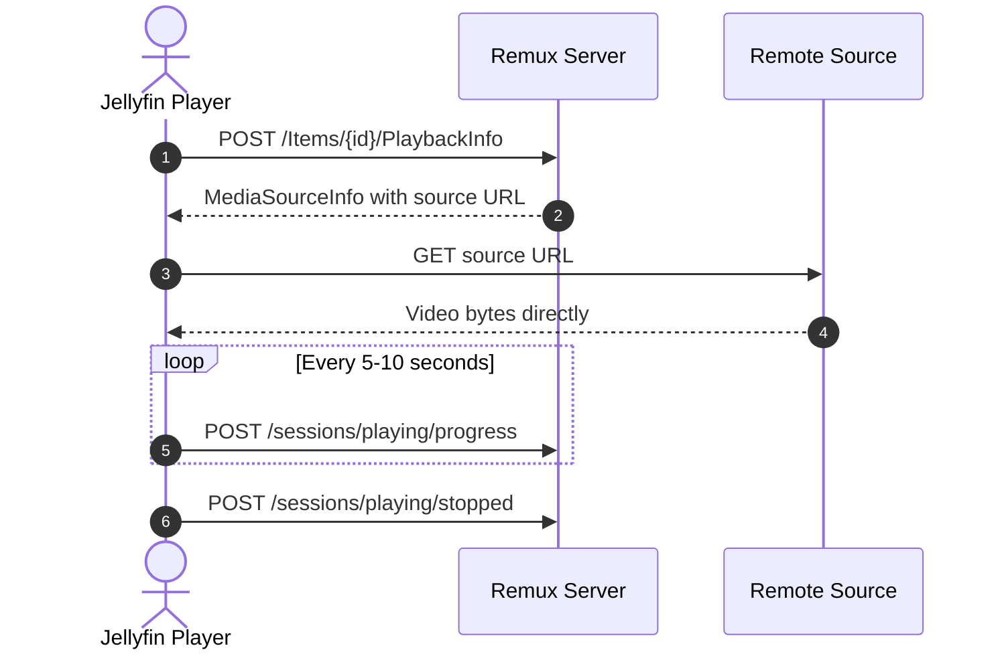

<div align="center">
   
</div>

<div align="center">
  <h1><b>Remux</b></h1>
  <p><i>Self-hosted media server with a Jellyfin-compatible API</i></p>
  <a href="https://discord.gg/rEbhk4RBhs">
    
  </a>
</div>

---

## About this project

This project is a fork of [Remux](https://github.com/lostb1t/remux), a Rust media server that combines Stremio add-ons, local files, WebDAV sources, torrents, and music providers behind a Jellyfin-compatible API.

The fork keeps Remux's goal of working with existing Jellyfin clients while changing how reachable HTTP streams are delivered: remote players receive the original stream URL and connect to the source directly. Remux remains responsible for metadata, session events, progress, resume points, and watched state, but it does not relay the video bytes when direct playback is safe.

## Features

- **Jellyfin-compatible clients**: Use Infuse, Swiftfin, Jellyfin for Android, Jellyfin Web, and other compatible clients without client changes.
- **Multiple content sources**: Combine Stremio add-ons, local files, WebDAV servers, torrents, and remote music sources in one library.
- **Direct remote playback**: Reachable HTTP streams are returned to players as HTTP media sources so the player connects directly to the CDN, add-on, or debrid provider.
- **Safe fallback streaming**: Local files, torrents, internal hosts, and other sources continue through Remux's streaming path when a direct URL cannot be safely exposed.
- **Built-in torrent streaming**: Stream torrents without running a separate torrent client or downloading the complete file first.
- **Probe data for streams**: Audio and subtitle track metadata is available for streamed content through [RemuxDB](https://remuxdb.1632022.xyz).
- **Library filtering**: Build dynamic libraries using tags, catalogs, popularity, release year, and per-user visibility rules.
- **Playback tracking**: Continue watching, resume points, watched state, and play counts remain synchronized across clients.
- **User management**: Import users and data from an existing Jellyfin server.
- **Desktop app**: Run the server from a macOS, Linux, or Windows tray application without Docker or a terminal.
- **Custom dashboard**: Configure the server through a built-in admin interface.
- **IPTV support**

## Direct streaming architecture

### Why the fork changes playback

The original proxy flow made Remux download every remote video and upload it again to the player. That added bandwidth, CPU usage, latency, and buffering on the Remux host, and prevented clients such as Infuse, Fusion, and Strand from using their native remote-streaming behavior.

For an externally reachable HTTP stream, the playback flow is now:



When a client still requests `/videos/{id}/stream`, Remux returns a temporary HTTP 302 redirect for a safe external HTTP source. This preserves compatibility with clients that use the Jellyfin stream endpoint while still avoiding a data relay.

### URL safety

Remux only forwards HTTP URLs that players can reasonably reach. Internal and private addresses, including loopback, LAN, link-local, CGNAT, Docker, `.local`, `.internal`, and `.lan` hosts, remain on the fallback proxy path.

Some add-ons return container-only URLs. For AIOStreams, Remux rewrites those URLs to the public origin from the add-on's `manifest_url` before exposing them to a player.

### Progress tracking still works

Direct playback does not bypass the Jellyfin session API. Players continue to report playback independently of the video connection:

| Endpoint                          | Purpose                                        |
| --------------------------------- | ---------------------------------------------- |
| `POST /sessions/playing`          | Register playback and its play session.        |
| `POST /sessions/playing/progress` | Update `PositionTicks` and live session state. |
| `POST /sessions/playing/stopped`  | Persist the final position and watched state.  |

Because playback metadata still includes the item ID and play session ID, resume points, scrobbling, webhooks, and watched state remain available even when the video bytes come directly from the remote source.

### Development

Install Cargo Make and the Dioxus CLI:

```sh
cargo install --force cargo-make
cargo install dioxus-cli
```

Then configure and start the development environment:

```sh
cp .env.example .env
cargo make jellyfin-web
cargo make dev
```

## Contributing

Issues, feature requests, and pull requests are welcome. Please test changes, explain behavior in human-written issue and pull request descriptions, and disclose significant AI-assisted contributions. Contributors remain responsible for understanding, reviewing, and testing everything they submit.

